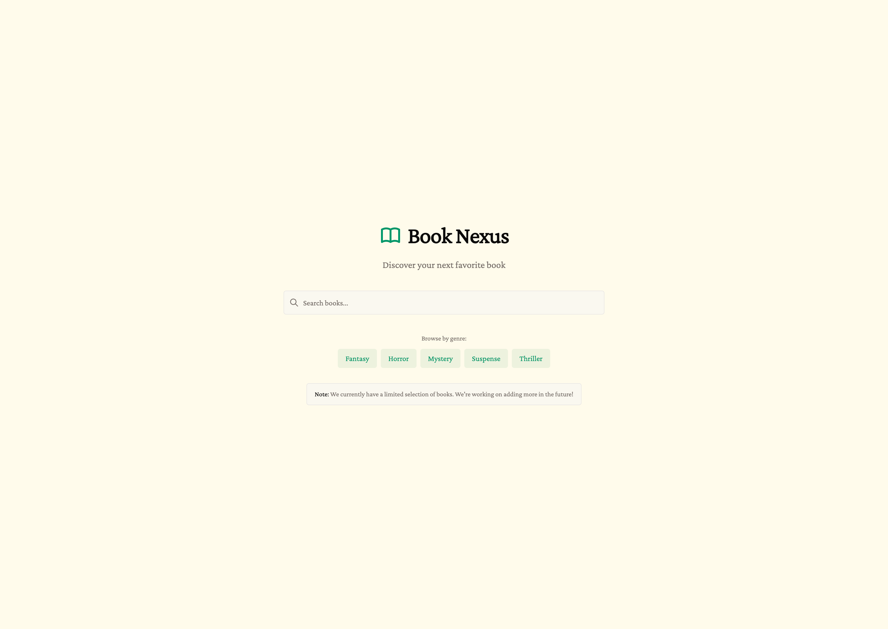
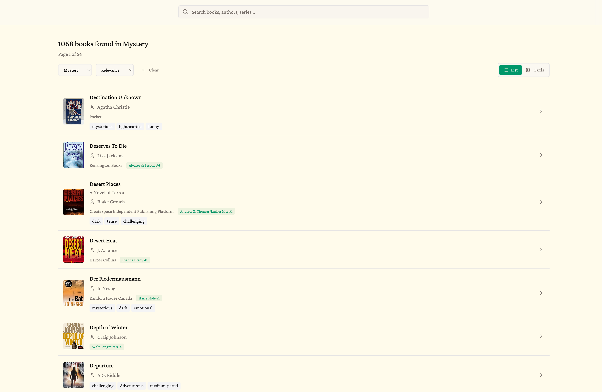

# Book Nexus

Book Nexus is a modern book discovery engine providing a single GraphQL entrypoint for all book data. While the initial launch focuses on horror and related genres, the goal is to be inclusive of all genres to serve a multitude of needs.




## Features

- **Advanced Search**: Full-text search across books, authors, publishers, and series
- **Book Discovery**: Browse books by genre, author, publisher, or series
- **Author Pages**: Explore author profiles with their complete bibliography
- **Series Information**: View book series with proper ordering
- **Smart Recommendations**: Get book recommendations based on your interests
- **Mobile-Friendly**: Responsive design that works on all devices
- **Admin Panel**: Manage books, authors, publishers, and series through a secure admin interface
- **Modern UI**: Built with shadcn/ui components and Tailwind CSS

## Tech Stack

### Backend

- **Go 1.24+**: High-performance backend language
- **GraphQL**: Single API endpoint using [gqlgen](https://gqlgen.com/)
- **PostgreSQL**: Relational database with normalized schema
- **Goose**: Database migrations
- **sqlc**: Type-safe SQL code generation
- **pgx**: PostgreSQL driver

### Frontend

- **React 19**: Modern React with hooks
- **TypeScript**: Type-safe frontend code
- **TanStack Router**: File-based routing
- **TanStack Query**: Data fetching and caching
- **Vite**: Fast build tool and dev server
- **Tailwind CSS**: Utility-first CSS framework
- **shadcn/ui**: High-quality component library
- **GraphQL Codegen**: Type-safe GraphQL queries

## Prerequisites

- Go 1.24+
- Node.js 21+
- pnpm
- PostgreSQL 16+
- Docker (optional; for running postgres in a container)

## Getting Started

This project uses a Makefile to simplify common development tasks. Most backend operations can be performed using `make` commands, making it easy to run, build, seed, and test the application.

### 1. Clone the Repository

```bash
git clone https://github.com/aileks/book-nexus.git
cd book-nexus
```

### 2. Backend Setup

#### Environment Variables

Copy `.env.example` and edit to add your own variables.

```bash
cp .env.example .env
```

#### Start PostgreSQL

**Option A: Using Docker (Recommended)**

```bash
make docker-run
```

This will start PostgreSQL in a Docker container.

**Option B: Local PostgreSQL**

Make sure PostgreSQL is running locally and update the `.env` file with your connection details.

#### Install Dependencies

```bash
go mod tidy
```

#### Start the Backend Server

The easiest way to get started is using the Makefile:

```bash
make run
```

This command will:

- Run database migrations automatically
- Start the GraphQL API server

The GraphQL API will be available at `http://localhost:8080/query` and the GraphQL Playground at `http://localhost:8080/`.

#### Seed the Database

After starting the server, you can seed the database with sample data:

```bash
make seed
```

Or seed from a custom CSV file:

```bash
make seed-csv CSV=path/to/your/file.csv
```

> ![NOTE] You will need to supply your own data. The default seed file is `data/books.csv`.

The GraphQL API will be available at `http://localhost:8080/query` and the GraphQL Playground at `http://localhost:8080/`.

### 3. Frontend Setup

#### Install Dependencies

```bash
cd frontend && pnpm install
```

#### Environment Variables

Create a `.env` file in the `frontend` directory (optional):

```env
VITE_API_URL=http://localhost:8080
```

If not set, the frontend will use the same origin as the frontend.

#### Generate GraphQL Types

```bash
pnpm run codegen
```

#### Start Development Server

```bash
pnpm run dev
```

The frontend will be available at `http://localhost:5173`.

## Project Structure

```
BookNexus/
├── cmd/
│   ├── api/             # Main API server entry point
│   └── seed/            # Database seeding utility
├── data/                # CSV data files for seeding
├── frontend/            # React frontend application
│   ├── src/
│   │   ├── components/  # React components
│   │   ├── lib/         # Utilities and GraphQL client
│   │   └── routes/      # TanStack Router routes
│   └── public/          # Static assets
├── graph/               # GraphQL schema and resolvers
├── internal/            # Internal packages
│   ├── authors/         # Author service
│   ├── books/           # Book service
│   ├── database/        # Database connection and migrations
│   ├── publishers/      # Publisher service
│   ├── recommendations/ # Recommendation service
│   ├── series/          # Series service
│   └── server/          # HTTP server setup
└── docs/                # Documentation and assets
```

## Development Commands

The project includes a comprehensive Makefile that simplifies common development tasks. All backend operations can be performed using `make` commands.

### Backend (Makefile)

**Quick Start Commands:**

```bash
# Start PostgreSQL with Docker
make docker-run

# Run the application (runs migrations automatically)
make run

# Seed the database with sample data
make seed
make seed-csv CSV=path/to/your/file.csv

# Stop PostgreSQL container
make docker-down
```

**Development Commands:**

```bash
# Build and test
make all

# Build the application
make build

# Run the application (includes automatic migrations)
make run

# Live reload during development (requires air)
make watch

# Run tests
make test

# Run integration tests
make itest

# Seed the database
make seed

# Seed from custom CSV file
make seed-csv CSV=path/to/file.csv

# Clean build artifacts
make clean
```

**Database Commands:**

```bash
# Start PostgreSQL with Docker
make docker-run

# Stop PostgreSQL container
make docker-down
```

The Makefile handles all the complexity of running migrations, building, and managing the database, making it easy to get started with the project.

### Frontend (pnpm)

```bash
# Start development server
pnpm run dev

# Build for production
pnpm run build

# Preview production build
pnpm run preview

# Run linter
pnpm run lint

# Format code
pnpm run format

# Generate GraphQL types
pnpm run codegen
```

## Database

### Schema

The database uses a normalized schema with separate tables for:

- **books**: Book information
- **authors**: Author information
- **publishers**: Publisher information
- **series**: Book series information

Relationships are maintained through foreign keys, ensuring data integrity.

### Migrations

Migrations are managed using [Goose](https://pressly.github.io/goose/) and are located in `internal/database/migrations/`. Migrations run automatically on server startup.

### Seeding

The database can be seeded from CSV files using the Makefile. The default seed file is `data/books.csv`.

**Using the Makefile (Recommended):**

```bash
# Seed with default CSV file
make seed

# Seed from a custom CSV file
make seed-csv CSV=path/to/your/file.csv
```

The seeding process:

1. Runs migrations automatically
2. Creates authors, publishers, and series as needed
3. Inserts books with proper relationships
4. Handles duplicates using `ON CONFLICT` clauses

## Admin Panel

The admin panel is available at `/admin` and provides:

- **Books Management**: Create, edit, and delete books
- **Authors Management**: Manage author information
- **Series Management**: Manage book series
- **Pagination**: Efficient browsing of large datasets

Access is protected by a password stored in browser session storage.

Set the ADMIN_PASSWORD environment variable in your `.env` file.

## Acknowledgments

- Built with [gqlgen](https://gqlgen.com/) for GraphQL
- UI components from [shadcn/ui](https://ui.shadcn.com/)
- Icons from [Tabler Icons](https://tabler.io/icons)
